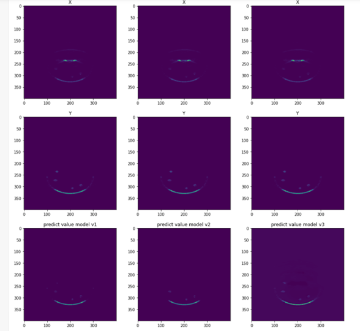
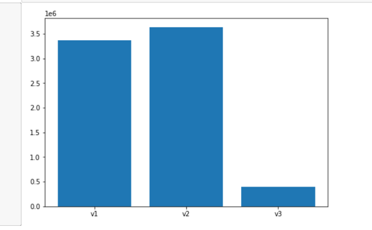

# Artifact reduction in LED based photoacoustic imaging using deep learning in U-net

### Aurther: Hongshuo Wang

#### Director: [Professor Sri-Rajasekhar (Raj) Kothapalli](https://www.bme.psu.edu/department/directory-detail-g.aspx?q=szk416) & PHD. SUMIT AGRAWAL
#### Range: 05/2021 - 08/2021

## references
1. https://github.com/nikhilroxtomar/UNet-Segmentation-in-Keras-TensorFlow
2. https://github.com/zizhaozhang/unet-tensorflow-keras
3. https://github.com/zhixuhao/unet
4. https://www.spiedigitallibrary.org/conference-proceedings-of-spie/11642/116421K/In-vivo-demonstration-of-reflection-artifact-reduction-in-LED-based/10.1117/12.2579082.short

## files
- modelv*.ipynb (training data)
- test.ipynb (testing output and visualization)
- test_matlab.mlx (matlab output) 
## output

## loss comparison

